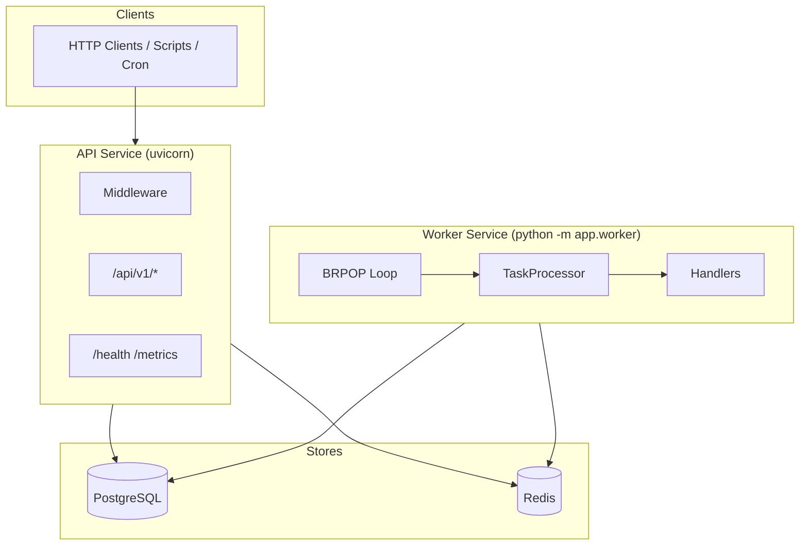
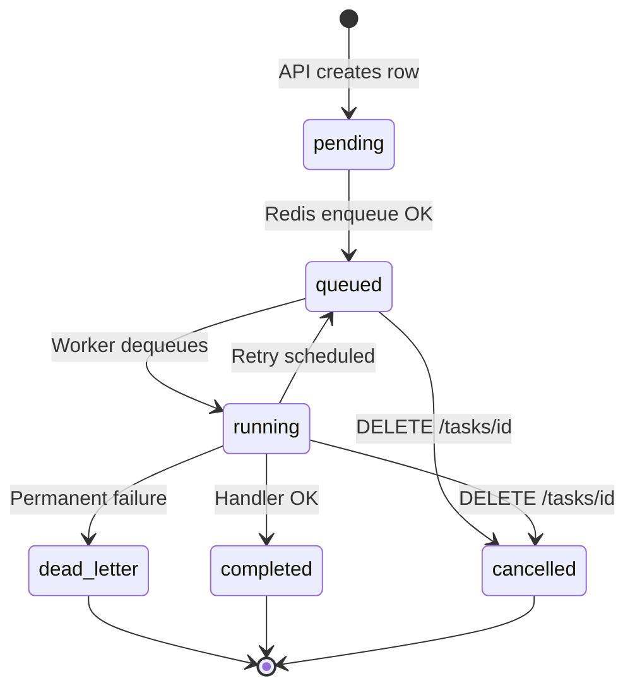
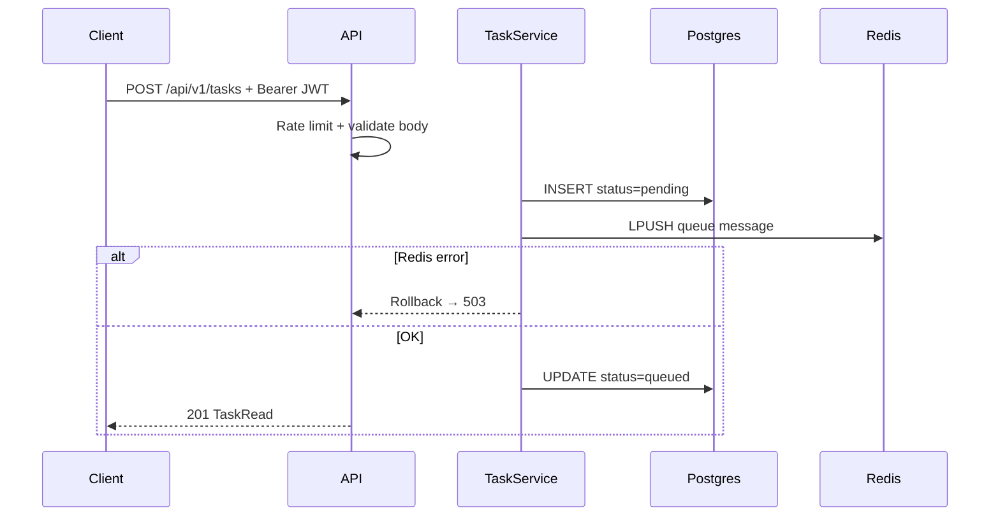
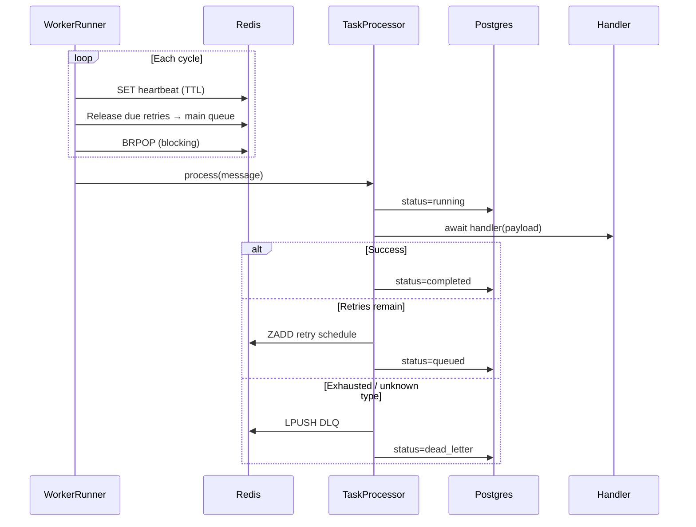

<div align="center">

# TaskForge

### Distributed Async Task Queue System

**Version 0.1.0** · FastAPI · Redis · PostgreSQL · Docker

Production-grade background job processing with retries, dead-letter queues,  
structured observability, JWT authentication, and API versioning.

</div>

---

## Table of Contents

1. [Executive Summary](#1-executive-summary)
2. [System Architecture](#2-system-architecture)
3. [Technology Stack](#3-technology-stack)
4. [Project Structure](#4-project-structure)
5. [Task Lifecycle](#5-task-lifecycle)
6. [Core Workflows](#6-core-workflows)
7. [Feature Reference](#7-feature-reference)
8. [API Reference](#8-api-reference)
9. [Redis Data Model](#9-redis-data-model)
10. [Database Schema](#10-database-schema)
11. [Configuration](#11-configuration)
12. [Quick Start](#12-quick-start)
13. [Local Development](#13-local-development)
14. [Testing](#14-testing)
15. [Observability](#15-observability)
16. [Security](#16-security)
17. [Operations & Troubleshooting](#17-operations--troubleshooting)
18. [Extending TaskForge](#18-extending-taskforge)

---

## 1. Executive Summary

**TaskForge** is a FastAPI-based distributed task queue. Clients submit background jobs over HTTP; a separate **worker** process dequeues work from **Redis**, executes registered handlers, and persists status in **PostgreSQL**.

| Capability | Description |
|------------|-------------|
| Task submission | Authenticated `POST` enqueues work with validated JSON payloads |
| Async processing | Dedicated worker service with FIFO Redis queue |
| Reliability | Exponential backoff retries and dead-letter queue (DLQ) |
| Cancellation | Remove pending work from queues and mark tasks cancelled |
| Observability | JSON logs, health checks, JSON metrics, Prometheus scrape |
| Security | JWT on submission, per-IP rate limiting, `/api/v1` versioning |

---

## 2. System Architecture

### 2.1 Component diagram



### 2.2 Docker Compose topology

| Service | Container | Command | Purpose |
|---------|-----------|---------|---------|
| **api** | `taskforge-api` | `alembic upgrade head && uvicorn …` | HTTP API + migrations |
| **worker** | `taskforge-worker` | `python -m app.worker` | Dequeue and process tasks |
| **postgres** | `taskforge-postgres` | Postgres 16 | Persistent task history |
| **redis** | `taskforge-redis` | Redis 7 (AOF) | Queues, retries, DLQ, heartbeat |

The API starts only after Postgres and Redis are healthy. The worker starts after the API (migrations applied).

### 2.3 Design principles

- **Postgres is the source of truth** for task status and audit history.
- **Redis is the transport layer** for fast enqueue/dequeue and delayed retries.
- **Thin HTTP layer** — business logic lives in `services/` and `worker/`.
- **Configuration via environment** — no hardcoded secrets (`pydantic-settings`).
- **Fail-safe enqueue** — if Redis fails after insert, the API transaction rolls back.

---

## 3. Technology Stack

| Layer | Technology |
|-------|------------|
| API framework | FastAPI + Pydantic v2 |
| ASGI server | Uvicorn |
| ORM / migrations | SQLAlchemy 2 (async) + Alembic + asyncpg |
| Queue | Redis 7 (lists + sorted sets) |
| Auth | JWT (`python-jose`) |
| Rate limiting | slowapi |
| Metrics | prometheus-client |
| Testing | pytest, pytest-asyncio, httpx, fakeredis |
| Runtime | Python 3.12, Docker Compose |

---

## 4. Project Structure

```
taskforge/
├── app/
│   ├── main.py                 # FastAPI entrypoint, middleware, routers
│   ├── api/
│   │   ├── router.py           # /api/v1 aggregate router
│   │   ├── deps.py             # FastAPI dependencies
│   │   └── routes/
│   │       ├── auth.py         # JWT token issuance
│   │       ├── tasks.py        # Submit, get, cancel
│   │       ├── health.py       # /health
│   │       └── metrics.py      # /metrics, /metrics/prometheus
│   ├── core/
│   │   ├── config.py           # Settings from .env
│   │   ├── logging.py          # JSON log formatter
│   │   ├── context.py          # correlation_id, task_id context vars
│   │   └── security.py         # JWT create/verify
│   ├── middleware/
│   │   ├── correlation.py      # X-Correlation-ID
│   │   └── request_logging.py
│   ├── schemas/                # Pydantic API models
│   ├── models/                 # SQLAlchemy ORM + TaskStatus enum
│   ├── db/                     # Async session factory
│   ├── services/               # TaskService, Health, Metrics
│   ├── queue/                  # Redis queue, DLQ messages
│   ├── worker/                 # Runner, processor, handlers, retry policy
│   └── observability/          # Prometheus metric definitions
├── alembic/                    # Database migrations
├── tests/
├── docker-compose.yml
├── Dockerfile
├── requirements.txt
├── .env.example
└── README.md
```

---

## 5. Task Lifecycle

### 5.1 Status state machine



### 5.2 Status definitions

| Status | Description |
|--------|-------------|
| `pending` | Row created; enqueue to Redis not yet confirmed |
| `queued` | On main queue or waiting for delayed retry |
| `running` | Worker is executing the handler |
| `completed` | Handler finished successfully |
| `cancelled` | Client cancelled; removed from Redis queues |
| `dead_letter` | Permanently failed; record copied to DLQ |
| `failed` | Reserved in enum; terminal failures use `dead_letter` |

---

## 6. Core Workflows

### 6.1 Submit a task



**Queue message format (JSON):**

```json
{
  "task_id": "3fa85f64-5717-4562-b3fc-2c963f66afa6",
  "task_type": "echo",
  "payload": { "message": "hello" }
}
```

### 6.2 Worker processing



### 6.3 Retry with exponential backoff

On handler failure:

1. Increment `retry_count`.
2. If `retry_count >= max_retries` → **dead letter**.
3. Else compute delay: `min(base × 2^(retry_count−1), max_seconds)`.
4. Store message in retry **ZSET** (score = run-at timestamp).
5. Set Postgres status back to `queued`.

Default: base **1s**, max **300s** → delays 1s, 2s, 4s, 8s, …

### 6.4 Dead-letter queue

When a task cannot succeed:

- Remove pending main-queue and retry entries for that `task_id`.
- **LPUSH** a `DeadLetterMessage` to the DLQ list.
- Set `status=dead_letter`, `error_message`, `completed_at`.

| Reason | When |
|--------|------|
| `max_retries_exceeded` | Handler failed after all retries |
| `unknown_task_type` | No handler registered |

### 6.5 Cancellation

`DELETE /api/v1/tasks/{id}` when status is `pending`, `queued`, or `running`:

- Scan Redis main list and retry ZSET; remove matching messages.
- Set `status=cancelled`, `completed_at=now`.
- Returns **409** if already terminal (`completed`, `cancelled`, `dead_letter`).

---

## 7. Feature Reference

### 7.1 Foundation (Phase 1)

| Feature | Implementation |
|---------|----------------|
| Docker Compose | `api`, `worker`, `postgres`, `redis` with healthchecks |
| Task model | UUID id, status, retries, JSONB payload, timestamps |
| Pydantic schemas | `TaskCreate` (input), `TaskRead` (output) |
| Migrations | Alembic; runs on API container start |

### 7.2 Core queue (Phase 2)

| Feature | Implementation |
|---------|----------------|
| Task submission | `TaskService.submit()` → Postgres + Redis LPUSH |
| Worker | `WorkerRunner` + `TaskProcessor` + handler registry |
| Task status | `GET /api/v1/tasks/{id}` from Postgres |

**Built-in handlers:**

| `task_type` | Behavior |
|-------------|----------|
| `noop` | No operation (testing) |
| `echo` | Requires `payload.message` |
| `always_fail` | Raises error (testing retries/DLQ) |

### 7.3 Reliability (Phase 3)

| Feature | Implementation |
|---------|----------------|
| Retries | Redis ZSET + `release_due_retries()` |
| DLQ | Redis list `TASK_DLQ_KEY` + `DeadLetterMessage` |
| Cancellation | `TaskService.cancel()` + queue cleanup |

### 7.4 Observability (Phase 4)

| Feature | Implementation |
|---------|----------------|
| JSON logging | `JsonFormatter` + correlation/task context |
| Health | `GET /health` — postgres, redis, worker heartbeat |
| JSON metrics | `GET /metrics` — depths, counts, success rate |
| Prometheus | `GET /metrics/prometheus` |
| Worker heartbeat | Redis key with TTL; refreshed each worker loop |

### 7.5 Security & polish (Phase 5)

| Feature | Implementation |
|---------|----------------|
| JWT | `POST /api/v1/auth/token` → Bearer on `POST /tasks` |
| Rate limiting | slowapi on task submission (default `30/minute`) |
| API versioning | All task/auth routes under `/api/v1` |

---

## 8. API Reference

### 8.1 Authentication

**Obtain token** (form-urlencoded):

```http
POST /api/v1/auth/token
Content-Type: application/x-www-form-urlencoded

username=admin&password=your-password
```

**Response:**

```json
{
  "access_token": "eyJ...",
  "token_type": "bearer"
}
```

Use on protected routes:

```http
Authorization: Bearer <access_token>
```

### 8.2 Tasks (v1)

| Method | Path | Auth | Description |
|--------|------|------|-------------|
| `POST` | `/api/v1/tasks` | **Required** | Submit task → `201` |
| `GET` | `/api/v1/tasks/{task_id}` | No | Get status → `200` / `404` |
| `DELETE` | `/api/v1/tasks/{task_id}` | No | Cancel → `200` / `404` / `409` |

**Submit body:**

```json
{
  "task_type": "echo",
  "payload": { "message": "hello" },
  "max_retries": 3
}
```

**Response (`TaskRead`):** `id`, `task_type`, `payload`, `status`, `retry_count`, `max_retries`, `error_message`, `created_at`, `updated_at`, `started_at`, `completed_at`.

### 8.3 Operations (unversioned)

| Method | Path | Description |
|--------|------|-------------|
| `GET` | `/` | Service metadata |
| `GET` | `/health` | `200` healthy / `503` degraded |
| `GET` | `/metrics` | JSON operational snapshot |
| `GET` | `/metrics/prometheus` | Prometheus text format |
| `GET` | `/docs` | Swagger UI (development only) |

### 8.4 HTTP status codes

| Code | Meaning |
|------|---------|
| `201` | Task created |
| `200` | Success (get, cancel, metrics) |
| `401` | Missing/invalid JWT or login failure |
| `404` | Task not found |
| `409` | Task not cancellable |
| `422` | Validation error (e.g. invalid UUID, empty `task_type`) |
| `429` | Rate limit exceeded |
| `503` | Redis unavailable on submit; or `/health` degraded |

---

## 9. Redis Data Model

| Key | Type | Operations | Purpose |
|-----|------|------------|---------|
| `taskforge:tasks:queue` | LIST | LPUSH / BRPOP | Main FIFO work queue |
| `taskforge:tasks:retry` | ZSET | ZADD / ZRANGEBYSCORE | Delayed retries (score = run time) |
| `taskforge:tasks:dlq` | LIST | LPUSH | Dead-letter audit records |
| `taskforge:worker:heartbeat` | STRING | SET EX | Worker liveness (TTL 60s) |

**FIFO semantics:** producers `LPUSH` to the head; workers `BRPOP` from the tail (oldest job first).

---

## 10. Database Schema

**Table: `tasks`**

| Column | Type | Notes |
|--------|------|-------|
| `id` | UUID | Primary key |
| `task_type` | VARCHAR(128) | Handler name, indexed |
| `payload` | JSONB | Optional arguments |
| `status` | ENUM | `task_status`, indexed |
| `retry_count` | INTEGER | Default 0 |
| `max_retries` | INTEGER | Default 3 |
| `error_message` | TEXT | Last failure reason |
| `created_at` | TIMESTAMPTZ | Server default |
| `updated_at` | TIMESTAMPTZ | Server default |
| `started_at` | TIMESTAMPTZ | Nullable |
| `completed_at` | TIMESTAMPTZ | Nullable |

---

## 11. Configuration

Copy `.env.example` to `.env` and adjust values.

| Variable | Default | Description |
|----------|---------|-------------|
| `DATABASE_URL` | — | Async Postgres URL (`postgresql+asyncpg://…`) |
| `REDIS_URL` | `redis://localhost:6379/0` | Redis connection |
| `TASK_QUEUE_KEY` | `taskforge:tasks:queue` | Main queue |
| `TASK_RETRY_QUEUE_KEY` | `taskforge:tasks:retry` | Retry ZSET |
| `TASK_DLQ_KEY` | `taskforge:tasks:dlq` | Dead-letter list |
| `WORKER_BRPOP_TIMEOUT` | `5` | Worker idle poll (seconds) |
| `RETRY_BACKOFF_BASE_SECONDS` | `1` | Retry delay base |
| `RETRY_BACKOFF_MAX_SECONDS` | `300` | Retry delay cap |
| `WORKER_HEARTBEAT_KEY` | `taskforge:worker:heartbeat` | Liveness key |
| `JWT_SECRET_KEY` | — | **Change in production** |
| `AUTH_USERNAME` / `AUTH_PASSWORD` | `admin` / … | Token endpoint credentials |
| `RATE_LIMIT` | `30/minute` | Task submission limit |
| `RATE_LIMIT_ENABLED` | `true` | Set `false` for tests |
| `LOG_LEVEL` | `INFO` | Logging verbosity |

---

## 12. Quick Start

### Prerequisites

- Docker and Docker Compose
- (Optional) Python 3.12+ for local dev

### Run the full stack

```bash
cp .env.example .env
# Edit .env — set passwords and JWT_SECRET_KEY for production

docker compose up --build
```

| URL | Service |
|-----|---------|
| http://localhost:8000 | API |
| http://localhost:8000/docs | Swagger (if `APP_ENV=development`) |
| http://localhost:8000/health | Health check |

### End-to-end example

```bash
# 1. Get JWT
TOKEN=$(curl -s -X POST http://localhost:8000/api/v1/auth/token \
  -d "username=admin&password=change-me-auth-password" \
  | python -c "import sys,json; print(json.load(sys.stdin)['access_token'])")

# 2. Submit task
curl -s -X POST http://localhost:8000/api/v1/tasks \
  -H "Authorization: Bearer $TOKEN" \
  -H "Content-Type: application/json" \
  -d '{"task_type":"echo","payload":{"message":"hello"}}'

# 3. Poll status (use id from response)
curl -s http://localhost:8000/api/v1/tasks/<TASK_ID>

# 4. Observability
curl -s http://localhost:8000/health | python -m json.tool
curl -s http://localhost:8000/metrics | python -m json.tool
```

---

## 13. Local Development

### Without Docker (API only)

```bash
python -m venv .venv
.venv\Scripts\activate          # Windows
pip install -r requirements.txt

cp .env.example .env
# Point DATABASE_URL and REDIS_URL to local services

alembic upgrade head
uvicorn app.main:app --reload
```

### Worker (separate terminal)

```bash
python -m app.worker
```

### Generate PDF from this README (optional)

GitHub renders this file automatically. To export a PDF locally:

```bash
# Using pandoc (install separately)
pandoc README.md -o TaskForge-Documentation.pdf --pdf-engine=xelatex -V geometry:margin=1in
```

Or open `README.md` in VS Code / Cursor and use **Markdown PDF** or print to PDF from the browser after viewing on GitHub.

---

## 14. Testing

```bash
pip install -r requirements.txt
pytest -v
```

| Suite | Requires Postgres |
|-------|-------------------|
| `test_task_schemas.py`, `test_retry_policy.py`, `test_logging.py` | No |
| `test_task_queue.py`, `test_dead_letter.py` | No (fakeredis) |
| `test_api_tasks.py`, `test_worker.py`, `test_task_service.py` | Yes (skips if unavailable) |

Integration tests use `TEST_DATABASE_URL` when set. Rate limiting is disabled via `RATE_LIMIT_ENABLED=false` in test config.

---

## 15. Observability

### 15.1 Structured logs

Each line is JSON:

```json
{
  "timestamp": "2026-05-20T12:00:00+00:00",
  "level": "INFO",
  "logger": "app.services.task_service",
  "message": "task submitted task_type=echo",
  "correlation_id": "550e8400-e29b-41d4-a716-446655440000",
  "task_id": "3fa85f64-5717-4562-b3fc-2c963f66afa6"
}
```

Send `X-Correlation-ID` on requests to tie client traces to API logs.

### 15.2 Metrics

**JSON (`/metrics`):**

```json
{
  "queue_depth": 2,
  "retry_queue_depth": 0,
  "dlq_depth": 1,
  "tasks_by_status": { "queued": 2, "completed": 10, "dead_letter": 1 },
  "success_rate": 0.909,
  "worker_heartbeat": "2026-05-20T12:00:00+00:00"
}
```

**Prometheus (`/metrics/prometheus`):** scrape with Prometheus or Grafana Agent.

Example metrics:

- `taskforge_tasks_submitted_total{task_type="echo"}`
- `taskforge_tasks_completed_total`
- `taskforge_queue_depth`
- `taskforge_task_processing_seconds_bucket`

---

## 16. Security

| Control | Detail |
|---------|--------|
| Secrets | All via environment variables; never committed |
| JWT | HS256; protect `JWT_SECRET_KEY` in production |
| Task submission | Bearer token required |
| Rate limiting | Per-IP on `POST /api/v1/tasks` |
| Docs | Disabled outside development (`APP_ENV`) |

**Production checklist:**

- [ ] Rotate `JWT_SECRET_KEY`, `AUTH_PASSWORD`, `POSTGRES_PASSWORD`
- [ ] Set `APP_ENV=production`, `DEBUG=false`
- [ ] Restrict network access to Postgres and Redis
- [ ] Terminate TLS at reverse proxy (nginx, Traefik, etc.)
- [ ] Consider protecting `GET`/`DELETE` with JWT if needed

---

## 17. Operations & Troubleshooting

| Symptom | Likely cause | Action |
|---------|--------------|--------|
| Task stuck `queued` | Worker down | Check `docker compose ps`; inspect heartbeat |
| `/health` worker down | No heartbeat key | Restart worker container |
| `503` on submit | Redis unreachable | Check `redis` service and `REDIS_URL` |
| `401` on submit | Expired/missing JWT | Call `/api/v1/auth/token` |
| `dead_letter` status | Retries exhausted or bad `task_type` | Read `error_message`; inspect DLQ in Redis |
| `429` | Rate limit | Slow down client or adjust `RATE_LIMIT` |

**Useful Redis commands (debug):**

```bash
docker exec -it taskforge-redis redis-cli
LLEN taskforge:tasks:queue
ZRANGE taskforge:tasks:retry 0 -1 WITHSCORES
LRANGE taskforge:tasks:dlq 0 -1
GET taskforge:worker:heartbeat
```

---

## 18. Extending TaskForge

### Add a new task handler

```python
# app/worker/handlers.py
from app.worker.handlers import register

@register("send_email")
async def send_email_handler(payload: dict | None) -> None:
    if not payload or "to" not in payload:
        raise ValueError("payload.to required")
    # ... send email ...
```

Submit with `"task_type": "send_email"` — no API changes required.

### Add API routes

1. Create `app/api/routes/your_route.py`.
2. Include router in `app/api/router.py` under `v1_router`.

### Future enhancements (not in scope)

- Admin UI for DLQ replay
- Priority queues
- Multiple worker pools
- OpenTelemetry tracing

---

<div align="center">

**TaskForge** — Built for learning and production patterns in distributed task processing.

For issues and contributions, use your repository's issue tracker.

</div>
